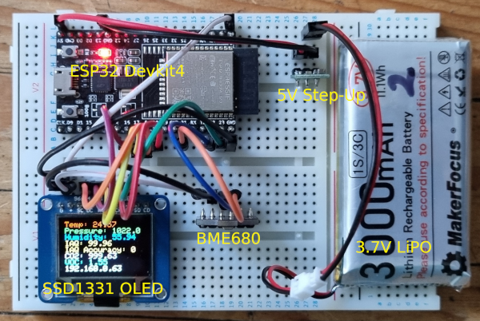

# ESP32 Indoor Air Quality (IAQ) Monitor Project

## Description

This [Espressif ESP32](https://www.espressif.com/en/products/hardware/esp32-devkitc/overview) educational project for the [VS Code](https://code.visualstudio.com/) / [PlatformIO](https://platformio.org/) platform implements a web-based Indoor Air Quality (IAQ) Monitor application using a [BME680 I2C sensor](https://www.bosch-sensortec.com/bst/products/all_products/bme680).

The application serves a web page giving ambient temperature, pressure, relative humidity, static indoor air quality (sIAQ) index, equivalent CO&#x2082; level and equivalent Breath Volatile Organic Compounds (bVOC) level. Historical data in JSON format is logged to the ESP32's SPI flash file system (SPIFFS) at a configurable interval and plotted as a series of trend graphs. Data from this log is reloaded from SPIFFS if the system is restarted.

Optionally, sensor readings can also be output to an SSD1331 SPI RGB OLED display.

## ESP32 Techniques

The project demonstrates a number of useful ESP32 techniques:
1. Web resource serving via SPI Flash File System (SPIFFS).
1. Implementation of [RESTful APIs](https://en.wikipedia.org/wiki/Representational_state_transfer) (GET and PUT) via native [AJAX](https://en.wikipedia.org/wiki/Ajax_%28programming%29) methods.
1. Parsing and manipulation of [JSON](https://en.wikipedia.org/wiki/JSON) data.
1. Data logging via SPIFFS.
1. Storage and retrieval of sensor calibration state via (emulated) EEPROM.
1. Setting system time from [NTP](https://en.wikipedia.org/wiki/Network_Time_Protocol) server.
1. Interfacing with [I2C](https://en.wikipedia.org/wiki/I%C2%B2C) sensors.
1. Use of the HTML5 canvas element.
1. Responsive web page design via CSS stylesheets.

The application implements the following RESTful APIs:

URL                          | Method | Description
---------------------------- | ------ | ------------------------------------------------
`http://esp32-ipaddr/sensor` |  GET   | Retrieve the latest sensor reading.
`http://esp32-ipaddr/log`    |  GET   | Retrieve the accumulated log file readings.
`http://esp32-ipaddr/config` |  GET   | Retrieve configuration settings. 
`http://esp32-ipaddr/config` |  PUT   | Update configuration settings via a simple form.

The log file can be accessed directly at the URL `http://esp32-ipaddr/logfile.json`.

## Dependencies

The project is built using Visual Studio Code with the PlatformIO extension.

The project requires the following libraries (the ESP32 libraries should be installed automatically when you set up
PlatformIO):

* [ESP32 WiFi](https://github.com/espressif/arduino-esp32/tree/master/libraries/WiFi) - WiFi.h
* [ESP32 WebServer](https://github.com/espressif/arduino-esp32/tree/master/libraries/WebServer) - WebServer.h
* [ESP32 EEPROM](https://github.com/espressif/arduino-esp32/tree/master/libraries/EEPROM) - EEPROM.h
* [ESP32 SPIFFS](https://github.com/espressif/arduino-esp32/tree/master/libraries/SPIFFS) - SPIFFS.h
* [ESP32 Time](https://github.com/esp8266/Arduino/blob/9913e5210779d2f3c4197760d6813270dbba6232/cores/esp8266/time.c) - time.h  (**NB**: this is the native ESP8266/ESP32 time library which implements the configTime() function for NTP)
* [ArduinoJson](https://github.com/bblanchon/ArduinoJson) - ArduinoJson.h  (Version >= 6.7)
* [BoschSensortec BSEC Arduino Library](https://github.com/BoschSensortec/BSEC-Arduino-library) - bsec.h

If you elect to display the output on an SSD1331 OLED, the following additional library will be required:
* [Adafruit SSD1331 Library](https://github.com/adafruit/Adafruit-SSD1331-OLED-Driver-Library-for-Arduino) - Adafruit_SSD1331.h

The default web page `/index.html` utilises 'minified' JavaScript and CSS to improve performance and reliability, in accordance with common industry practice. The original `.js` and `.css` files are in the `/src` folder. The minified (`*.min.*`) versions of these files will need to be regenerated if you edit the source, and then copied to the `/data` folder (e.g. via custom VSCode tasks). The project uses [UglifyJS2](http://lisperator.net/uglifyjs/) to minify JS files and [YUICompressor](http://yui.github.io/yuicompressor/) to minify CSS files - see `npm` installation procedures for these utilities at their respective web links.

Alternatively, you can amend `/index.html` to use the uncompressed `.js` and `.css` files and move these to the `/data` folder.

**NB** The contents of the `/data` folder must be uploaded to the ESP32's SPIFFS file system using the PlatformIO tasks 'Build Filesystem Image' and 'Upload Filesystem Image'. You may also need to erase the emulated EEPROM if the device has been previously used.

## Wiring Connections

<!-- START WIRING TABLE -->

Pin on BME680 Sensor | GPIO Pin on ESP32  | Purpose
-------------------- | ------------------ | --------------------------------------------------------- 
GND                  | GND                | Ground
VIN                  | 3V3                | Power **NB** some boards may need 5V - check datasheet
SCL                  | Pin 22 (WIRE_SCL)  | I2C Clock
SDA                  | Pin 21 (WIRE_SDA)  | I2C Data

if using SSD1331 OLED:

Pin on SSD1331 OLED  | GPIO Pin on ESP32   | Purpose
-------------------- | ------------------- | --------------------------------------------------------- 
GND (G)              | GND                 | Ground
VIN (+)              | 3V3                 | Power **NB** some boards may need 5V - check datasheet
CS (OC)              | Pin 5 (VSPI_SS)     | SPI Chip Select
RST (R)              | Pin 16              | SPI Reset
DC                   | Pin 17              | SPI Data
SCLK (CK)            | Pin 18 (VSPI_SCK)   | SPI Clock
MOSI (SI)            | Pin 23 (VSPI_MOSI)  | SPI Main Out Secondary In

<!-- END WIRING TABLE -->

<!-- START COMPATIBILITY TABLE -->

## Compatibility

MCU / Browser              | Tested Works | Doesn't Work | Not Tested  | Notes
-------------------------- | :----------: | :----------: | :---------: | --------------------------
ESP32 Dev Module @ 240MHz  |      X       |              |             | 
Firefox, all platforms     |      X       |              |             | 
Safari, all platforms      |      X       |              |             |
Chrome on Windows, Android |      X       |              |             | 
Opera on Windows, Android  |      X       |              |             | 
Opera on IOS               |      X       |              |             |  
Edge on Windows, Android   |      X       |              |             | 
Edge on IOS                |      X       |              |             | 
IE 11 on Windows           |      X       |              |             |  
IE < 11 on Windows         |              |              |      X      |  

<!-- END COMPATIBILITY TABLE -->

## Author Information

semuadmin@semuconsulting.com
